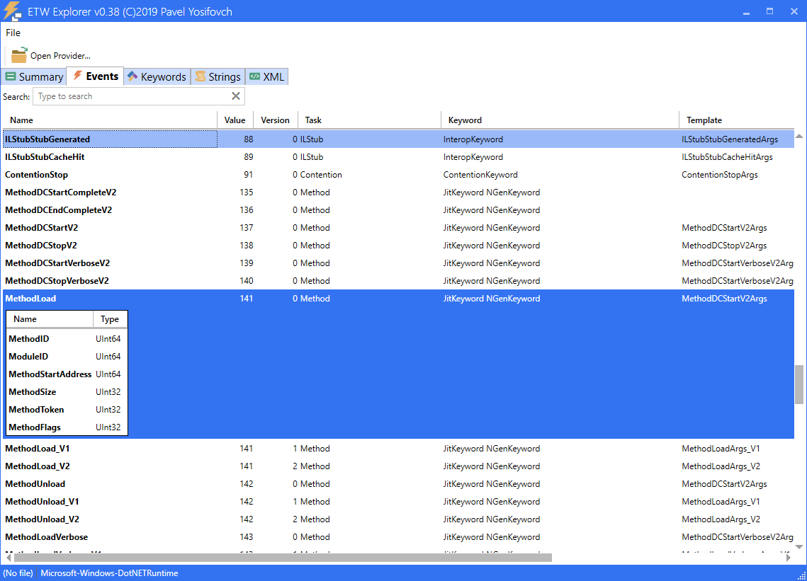

# EtwExplorer
View ETW Provider metadata

Event Tracing for Windows ([ETW](https://docs.microsoft.com/en-us/windows/win32/etw/event-metadata-overview)) is a logging facility built into the Windows OS. Modern providers register a manifest that describes all the events they support, with their properties. Classic providers register a MOF instead.

ETW Explorer attempts to show these events with a simple GUI.

